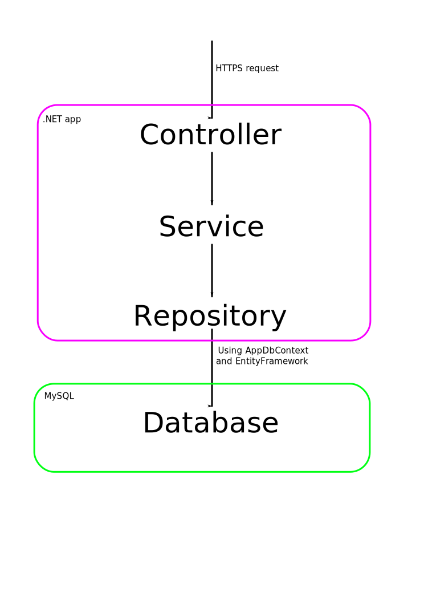

This project is meant to show my coding style in C#. This is simple rest API.

Architecture
===
Architecture is too complicated for such small project, but this is only demonstration. For example there is abstarct generic class `AbstractRepository<T>` that is used only one time, but in real projects there would be multiple classes inheriting from it.

Tests
===
I made only integrational tests, because project was simple enought and I didn't see need for unit tests.